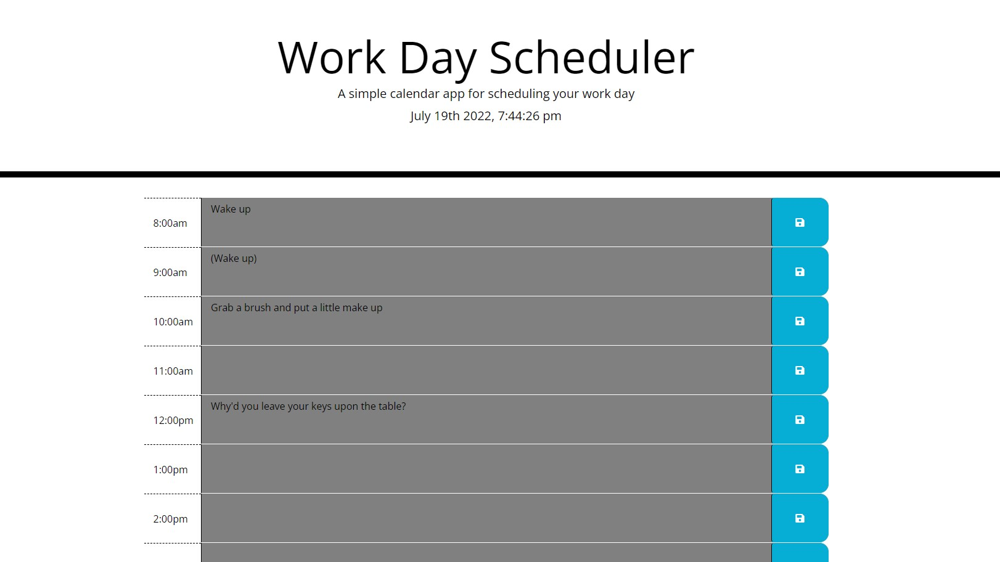

# Daily-Planner
Daily Planner to schedule your work day and save the info in local storage.

## Description
This application works by tracking the hours in the day and changing the color depending on whether the hour is current, has passed or has yet to come. Past hours are greay, the current hour is green and future hours are yellow. It will save any data enterd into the time block to local storage when the save button is clicked.

## Installation
The planner can be accessed through your web browser.

## Preview

## Credits

youtube.com

w3schools.com

Matthew Tierney, classmate 

## License 

MIT License

Copyright (c) [2022] [Christian Fellwock]

Permission is hereby granted, free of charge, to any person obtaining a copy
of this software and associated documentation files (the "Software"), to deal
in the Software without restriction, including without limitation the rights
to use, copy, modify, merge, publish, distribute, sublicense, and/or sell
copies of the Software, and to permit persons to whom the Software is
furnished to do so, subject to the following conditions:

The above copyright notice and this permission notice shall be included in all
copies or substantial portions of the Software.

THE SOFTWARE IS PROVIDED "AS IS", WITHOUT WARRANTY OF ANY KIND, EXPRESS OR
IMPLIED, INCLUDING BUT NOT LIMITED TO THE WARRANTIES OF MERCHANTABILITY,
FITNESS FOR A PARTICULAR PURPOSE AND NONINFRINGEMENT. IN NO EVENT SHALL THE
AUTHORS OR COPYRIGHT HOLDERS BE LIABLE FOR ANY CLAIM, DAMAGES OR OTHER
LIABILITY, WHETHER IN AN ACTION OF CONTRACT, TORT OR OTHERWISE, ARISING FROM,
OUT OF OR IN CONNECTION WITH THE SOFTWARE OR THE USE OR OTHER DEALINGS IN THE
SOFTWARE.